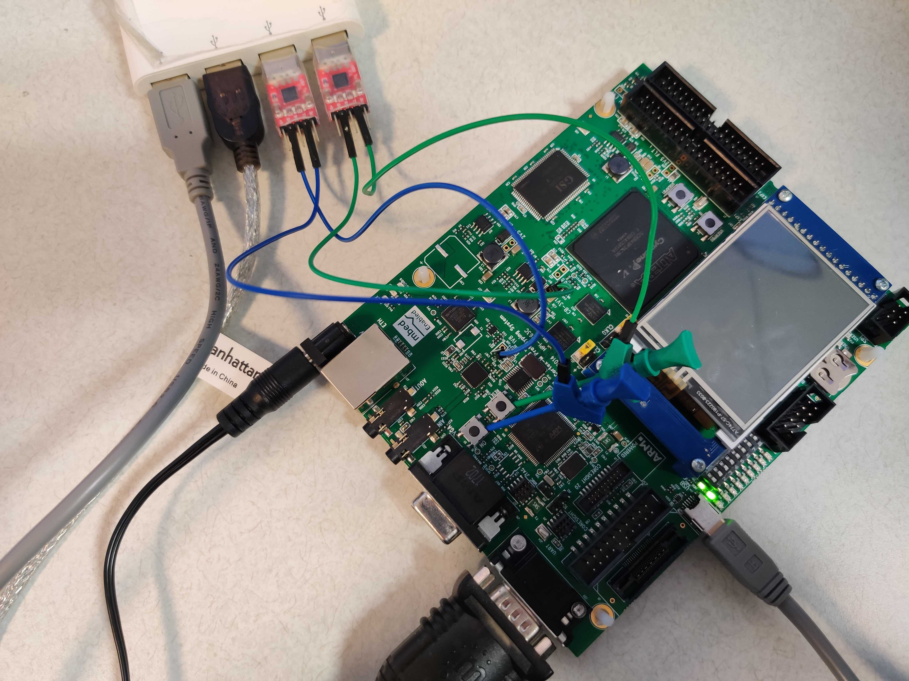

# SHERLOC: Secure and Holistic Control-Flow Violation Detection on Embedded Systems

Sherloc is a secure and holistic control flow violation detection mechanism for microcontroller-based embedded systems.
This repository contains the source code, example applications, and evaluation tools required to understand, use, and evaluate Sherloc.
We tested our implementation on an ARM **V2M-MPS2+** Evaluation Board.

The results of this project were published in the paper entitled "[SHERLOC: Secure and Holistic Control-Flow Violation Detection on Embedded Systems](https://cactilab.github.io/assets/pdf/sherloc2023.pdf)" in the ACM Conference on Computer and Communications Security (CCS) 2023. If you want to cite our paper in your work, please use the following BibTeX entry.
```
@inproceedings{tan2023ccs,
 title = {SHERLOC: Secure and Holistic Control-Flow Violation Detection on Embedded Systems},
 author = {Tan, Xi and Zhao, Ziming},
 booktitle = {ACM Conference on Computer and Communications Security (CCS)},
 year = {2023},
}
```
---

## Repository Structure

This repository is organized into three main folders:

1. _Sherloc_runtime_: Sherloc implementation.
2. _Example_: various example applications to demonstrate Sherloc's functionality.
3. _host_tool_: tools for static analysis and evaluation of Sherloc.

### Prerequisites

- Environment prerequisites
  - Hardware: [MPS2+ board](https://developer.arm.com/Tools%20and%20Software/MPS2%20Plus%20FPGA%20Prototyping%20Board)
  - System: Windows. We have tested on Windows 11, Windows 10 may also work.
  - Software: licensed Keil [uVision5](https://www.keil.com/demo/eval/arm.htm), python3, Jupyter notebook
    - Required Python libraries: please refer to `host_tools/evaluation/requirements.txt`
- Knowledge prerequisites
  - C and Python programming languages.
  - Keil uVision5 IDE and Jupyter notebook.
  - Serial port communication and logic analyzer.
  - Cortex-M33 architecture.

### 1. Sherloc_runtime

This folder contains the Sherloc implementation and is organized into the following sub-folders:

- _src_: source code for Sherloc.
  - _inc_: header files for Sherloc.
  - _src_: source files for Sherloc.
     - To see the full implementation of Sherloc, please check the code located at MACRO `FULL_IRQ`.
- _inc_: header files for Sherloc.
- _lib_: evaluation functions.
- _freertos_: FreeRTOS kernel code.
- _evaluation_: BEEBS source code for evaluation purposes.

### 2. Example

This folder contains the following example applications:

- _Sherloc_Blinky_S_NS_: Demonstrates Sherloc on a bare-metal system.
- _Sherloc_FreeRTOS_MPU_S_NS_: Demonstrates Sherloc on a FreeRTOS system with MPU enabled.
- _Sherloc_S_NS_: Demonstrates Sherloc on BEEBS benchmarks.
- _Trigger_S_NS_: Demonstrates Sherloc on FreeRTOS system that uses LED
- _Vulfoo_S_NS_: Implements a stack-overflow bug inside a FreeRTOS task to test Sherloc's detection efficiency.
- _Vulfoo_Task_S_NS_: Implements a simple demo that an attacker can arbitrary modify FreeRTOS's task context.
- Additionally, the **out** folder is used for evaluation purposes and contains the `out/eval` sub-folder, which has the compiled protected system in `O3` and `Oz` optimization levels separately.
  - Our repo already has the evaluation results you can check, which contain the following:
    - _elf_s_: Sherloc runtime for different evaluation purposes. They are re-compiled Sherloc runtime, copying from `Sherloc/host_tools/evaluation/elf_s`
    - _Oz_/_O3_: contains the metadata and evaluation results of different optimization levels of protected systems. This folder involves:
      - _proj_: build files for protected systems
      - _build_tmp_: build logs for protected systems
      - _elf_ns_: binaries for protected systems
      - _metadata_: _/*/_bin_ contains the IBT, IRQ entry, or task entry for RTOS.
        You can also check the content in _/*/_h_ and _/*/_dump_ files.
      - _eval_log_: evaluation results for protected systems.
        Inside this folder, it contains:
        - _eval.log_: evaluation logs, which tell you the running progress
        - _record.log_: evaluation steps record tells you what sub-steps we have already evaluated. Refer to the folder _host_tools/elf_s_ explanation to check what those sub-steps are (consistent within the paper figure 7 and 8).
          - **ATTENTION 1**: if you want to re-run the evaluation, please delete this file.
        - Other log files: evaluation results for evaluation sub-steps.
  - **[Recommend]** To generate evaluation results from the beginning, please check **Step 2: Automatically run those examples.**
  - If you want to run those examples manually, please check **Step 2: Manually run those examples.**

### 3. host_tool

This directory includes an `evaluation` folder, encompassing various Python scripts crucial to the project's operations.
These scripts are designed to manage project building, conduct static analysis, execute runs, perform evaluations, and analyze the results obtained from these evaluations.

- Files for project building:

  - _blinky_, _freertos_, _led_trigger_, _vulfoo_, _task_vulfoo_: source files and Keil xml configuration files.
  - _elf_s_: re-compiled Sherloc runtime binaries.
  - _rtos_: task entry list for FreeRTOS.
    - **ATTENTION 2**: if you create a new task in FreeRTOS, please add the task name to this file.
    <!-- - [TODO]: Provide the script to automatically get the task entry from the FreeRTOS binary code. -->
  - _uvprojx_: Keil xml configuration files for BEEBS.

- Auto scripts
  - _ibt_analysis.py_: static analysis to get the IBT.
  - _eval.py_: helper functions declared here for the whole evaluation process.
  - _eval_beebs.py_: python script for BEEBS evaluation.
  - _eval_blinky.py_: python script for blinky evaluation.
  - _eval_freertos.py_: python script for FreeRTOS, including the MPU event-triggered case.
  - _eval_trigger.py_: python script for FreeRTOS LED event-triggered case.
  - _eval_vulfoo.py_: python script for FreeRTOS buffer overflow attack.
  - _eval_run.py_: python script to control which target system to be evaluated.
  - _ibt_checking.ipynb_ (optional): Jupyter Notebook script to count the IBT size.
    The evaluation process does not need this script, you may run it manually to check the result.
  - _run.ipynb_ (optional): Jupyter Notebook script will help you find the serial port for hardware and software reset.
  - _result.py_: python script to read evaluation results and calculate the performance overhead.

## Getting Started

### Step 1: Environment setup

- Configure the board loading files.
  - Refer to [using the Cortex-M33 IoT Kit Image on MPS2+](https://www.keil.com/appnotes/files/apnt_300.pdf).
  - Find the file system of this board, usually the drive name is `V2M_MPS2`.
  - Assign the `E` letter to the `V2M_MPS2` drive.
  - Open `/MB/HBI0263C/AN505`, copy `Sherloc_runtime/images.txt` to this folder.
- Clone the repository to your local machine.
- (Optional) If you want to **automatically** run scripts to build, run, evaluate, and evaluate results analysis, we use two USB2TTL adaptors to simulate button pressing: one for hardware rest, one for software reset.
  To make this work, you need the logic analyzer clipper * 2, jumper wire male *2, and jumper wire female /*2.
  The connection wires are shown below:
  

### Step 2: Automatically run those examples

- Those auto scripts do not need the Keil IDE.
- We have compiled protected systems located at `Example/out/eval/[Oz/O3]` folder.
- We have compiled the Sherloc runtime located at `host_tools/evaluation/elf_s`.
- Check the `device manager` of the Windows system to figure out the hardware and software reset serial ports. We have scripts to help you find the serial and software ports for hardware reset. Please refer to `host_tools/evaluation/run.ipynb` for more details.

#### Step 2.1: Run auto scripts to build, run, evaluate, and evaluate results analysis

- Backup or delete old evaluation results, which is located at `Example/out` folder.
- `cd` to the `host_tools/evaluation` directory.
- Run `python eval_run.py`. For more details, please check the implementation of `host_tools/evaluation/eval_run.py`.
  - **ATTENTION 3**: Sometimes, the board's file systems may be unstable. If you find the board cannot be detected, please re-plug the board and run the script again.
    `out/eval/[O3/Oz]/eval.log` and `out/eval/[O3/Oz]/record.log` will show the running progress.
  - **ATTENTION 4**: All `prepare*` functions inside the `eval_run.py` will replace the metadata (especially the IBT) generated before. If you want to keep the metadata, please comment on those functions.
  - **ATTENTION 5**: As the example `vulfoo` and `task_vulfoo` demonstrate Sherloc's detection efficiency, the protected system will never call nsc to switch state to print out evaluation results.
    The log will look stuck without output.
    - After running this example for 1 minute, if there is no dynamic training log, you must manually stop the execution and comment `self.trigger_prepare_run()` and `self.trigger_emu_run()`.
      Then re-run the board to run the next step.
    - The signal to show that Sherloc detects the attack is that the log will show:
      ```log
      [0]illegal transfer:0x070c0764
      ```
      or
      ```log
      [0] Wrong IRQ exit: 0x00201f00, 0xffffffbc, 0xffffffbd, 0x0020264c
      Check stack. top: 0.
      0x00202588
      Check task list. num: 6.
      0x00201e3c
      0x0020160a
      0x002026a8
      0x0020264a
      0x00202676
      0x002026a8
      ```
    - To identify if those errors are true errors, refer to `out/eval/O[z/3]/metadata/*.dump` to check the address.

#### Step 2.2: Check the evaluation results

- After all the evaluations are finished, run `python result.py` to get the performance overhead. For more details, please check the implementation of `host_tools/evaluation/result.py`.

### Step 2: Manually run those examples

- Navigate to the desired example application folder within the EXAMPLE directory. You may want to open the project via `Keil IDE`.
  The Example project is a multi-project workspace, including the non-secure target protected system and the secure Sherloc runtime project.
  - The target protected system is in the `*_NS` folder.
    - Compile it accordingly.
  - The Sherloc runtime is located in the folder `*_S` folder, using the same Sherloc runtime source code for all examples. Refer to `Sherloc_runtime/[inc/src]` folder.
    - Compile and run the example application according to its specific instructions controlled by `MACROS`. Please check [Sherloc_runtime/README.md](./Sherloc_runtime/README.md) for more details.
- Instructions to Build and Run:
  - The Keil multi-project workspace `*.uvmpw` contains projects for both the secure project, and non secure project.
  - Set the `_s` project as Active - Right click on "Project: `_s`" and select "Set as Active Project".
  - Build the `*_s` project using "Project --> Build" or by pressing F7.
  - Set the `_ns` project as Active - Right click on "Project: `_ns`" and select "Set as Active Project".
  - Build the `*_ns` project using "Project --> Build" or by pressing "F7".
  - Start Debug Session using "Debug -> Start/Stop Debug Session" or by pressing "Ctrl+F5".
- All compiled binaries are in the `out` folder. Then:

  1. Prepare the metadata for runtime CFVD.
     - 1.1. Copy the `*.axf` file of the target protected system to the `out/eval/O[z/3]/elf_ns` folder based on its optimization level and rename it to the target you are evaluating. You can check the TargetName in the `eval_run.py` file.
     - 1.2. Go to `eval_run.py`, for BEEBS, and modify the `self.BEEBS_NAME_list` to contain the name you want to evaluate. For blinky, freertos, led_trigger, and vulfoo, modify the `self.TargetName` to contain the name you want to evaluate.
     - 1.3. Comment out the `*_emu_run()` and `*_eval_run()`.
     - 1.4. Run `python eval_run.py` to get the static analysis result. The `*.bin` is located at `out/eval/O[z/3]/metadata`.
  2. Prepare the evaluation binaries for runtime CFVD.
     - Copy `*.bin` generated at step 1.4. to MPS2+ board, put it in the `SOFTWARE` folder, and rename it to `bs.bin`.
     - Copy `*.axf` of the target protected system to the MPS2+ board, put it to the `SOFTWARE` folder, and rename it to `ns.axf`.
     - Copy the Sherloc runtime compiled before to the MPS2+ board, put it to the `SOFTWARE` folder, and rename it to `s.axf`.
  3. Software reset the board.
  4. Check the evaluation output.
     - You can use `putty` to connect to the serial port. The baud rate is 115200.
     - Or you can write a Python script to read the serial port.
     - The output will be like this:
       ```log
       Monitor Mode Debug Enabled!
       branch table size: 0, IRQ size: 3, Task size: 0, LOOP size: 4, tag_size: 0

       ----Load branch table done.---
       ----Binary search enabled.---
       Hello World (Secure)
       NONE: 21071877
       ```

---

NOTE: Evaluation results can vary depending on several factors: optimization level, target system, Keil compiler version, etc.

---

## Contributing

We welcome contributions to improve Sherloc. Please submit your pull requests or open an issue to discuss your ideas.

## Contacts

Xi Tan: <a href="mailto:xitan@buffalo.edu">xitan@buffalo.edu</a>

Ziming Zhao: <a href="mailto:zimingzh@buffalo.edu">zimingzh@buffalo.edu</a>

## License

Sherloc is released under the Apache License.
